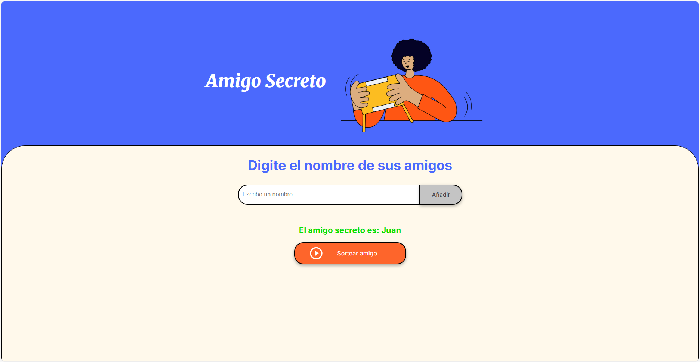

# Challenge Amigo Secreto - Lógica de Programación

Este repositorio contiene mi entrega para el primer challenge de la Formación Principiante en Programación de ALURA ONE.

## 📋 Descripción del Proyecto

**Amigo Secreto** es una aplicación web simple que permite seleccionar aleatoriamente un "amigo secreto" de una lista de nombres. Los usuarios pueden agregar nombres de amigos y realizar un sorteo para elegir uno de ellos al azar.

## 🎯 Funcionalidades

- ✅ Agregar nombres de amigos a la lista
- ✅ Validar que no se ingresen nombres vacíos
- ✅ Mostrar lista de amigos agregados
- ✅ Realizar sorteo aleatorio para elegir un amigo secreto
- ✅ Mostrar el resultado del sorteo
- ✅ Limpiar la lista automáticamente después del sorteo

## 🛠️ Tecnologías Utilizadas

- **HTML5** - Estructura de la aplicación
- **CSS3** - Estilos y diseño responsive
- **JavaScript** - Lógica de programación y funcionalidades

## 🚀 Cómo Usar

1. Abre el archivo `index.html` en tu navegador web

   

2. Ingresa el nombre de un amigo en el campo de texto

   

3. Haz clic en "Añadir" para agregar el nombre a la lista
4. Repite los pasos 2-3 para agregar todos los amigos que desees

   

5. Haz clic en "Sortear amigo" para seleccionar aleatoriamente un amigo secreto
6. ¡Ve qué amigo fue seleccionado!

   

7. La lista se limpia automáticamente para comenzar un nuevo sorteo

## 📁 Estructura del Proyecto

```
challenge-amigo-secreto/
├── index.html         # Página principal
├── style.css          # Estilos de la aplicación
├── app.js             # Lógica de JavaScript
└── README.md          # Este archivo
```

## 🎓 Aprendizajes

Durante el desarrollo de este challenge pude practicar y aplicar:

- Manipulación del DOM con JavaScript
- Uso de arrays y métodos de JavaScript
- Validación de formularios
- Generación de números aleatorios
- Estructura de control (condicionales y bucles)
- Funciones en JavaScript
- Eventos del navegador
